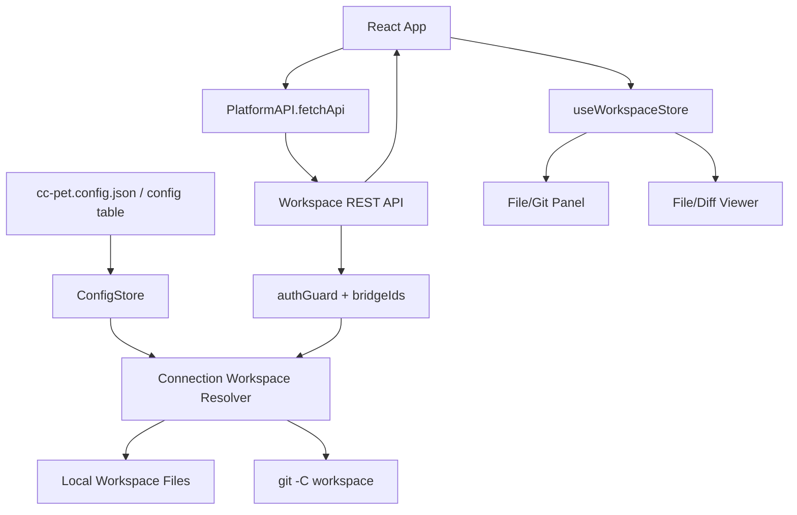
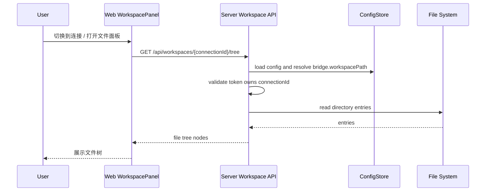
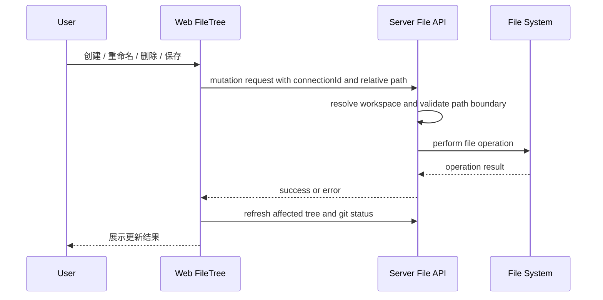
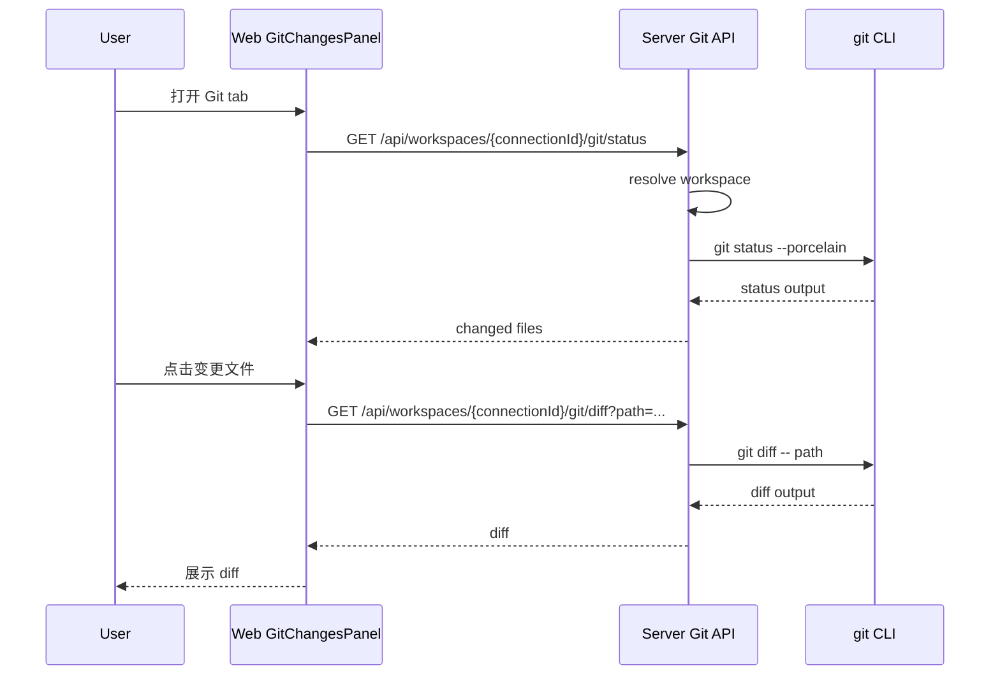

# Implementation Plan: 文件列表与 Git 变更查看

**Workspace**: `add-file-git-features` | **Date**: 2026-05-12 | **Spec**: [spec.md](spec.md) | **Explore**: [explore.md](explore.md)
**Input**: Feature specification from `specs/add-file-git-features/spec.md`

---

## Summary

为每个连接的配置增加工作区路径，并在服务端新增受授权保护的工作区文件/Git API。前端在现有 Layout 侧栏中增加工作区面板，按当前连接加载文件树和 Git 变更，并用独立查看器面板展示文件内容和 diff。

---

## Architecture Overview



数据流按当前活跃连接驱动：`useConnectionStore.activeConnectionId` 变化后，前端重新请求该连接的工作区信息、文件树和 Git 状态。服务端只接受相对路径，先通过 token 授权校验 `connectionId`，再从配置中解析该连接的 `workspacePath`。

---

## Key Design Decisions

### Decision 1: 工作区路径作为 BridgeConfig 的连接级字段

- **背景**: Spec 要求工作区“每个连接绑定，从配置文件获取”。现有连接的 SSoT 是 `BridgeConfig`，前后端都通过 `connectionId` 识别 bridge。
- **选项**:
  - A: 在 `BridgeConfig` 增加 `workspacePath?: string`。优点是与连接天然绑定，配置读取链路最短；缺点是需要扩展共享类型和配置归一化。
  - B: 新增独立 `workspaces` 配置数组。优点是未来可多工作区；缺点是首版需要额外关联模型，与当前 spec 不匹配。
- **结论**: 选择 A，字段名使用 `workspacePath`，保持可选以兼容旧配置。
- **后果**: 未配置或路径无效的连接仍可聊天，但文件/Git 面板显示“未配置工作区”。

### Decision 2: 文件/Git 能力走服务端 REST API

- **背景**: Web 前端运行在浏览器环境，不能直接访问本机文件系统；服务端已负责本地配置、数据目录和认证。
- **选项**:
  - A: 服务端提供受保护 REST API。优点是可统一授权、路径边界和 Git 执行；缺点是新增接口面。
  - B: 通过 Bridge/Agent 返回文件信息。优点是少新增服务端能力；缺点是依赖 Agent 状态，无法稳定提供 UI 基础能力。
- **结论**: 选择 A。
- **后果**: 需要明确 API 契约、路径安全策略和服务端测试。

### Decision 3: Git 使用系统 git 命令，不新增依赖

- **背景**: `@cc-pet/server` 当前没有 Git 依赖；首版只需要 status 和 diff。
- **选项**:
  - A: 使用 Node 子进程调用 `git`。优点是零新增依赖，能力足够；缺点是需要处理 git 不存在、超时和输出上限。
  - B: 引入 Git 封装库。优点是 API 友好；缺点是新增依赖和学习成本。
- **结论**: 选择 A，并统一封装命令执行。
- **后果**: 非 Git 仓库、未安装 git、超大 diff 都需要返回可展示的错误或空态。

---

## Module Design

### Module: Shared Config Types

**职责**: 定义连接配置中工作区路径的跨包类型。

**改动概述**: 扩展 `BridgeConfig`，让每个 bridge 可携带 `workspacePath`。

**新增/变更接口**:

```text
BridgeConfig:
  id
  name
  host
  port
  token
  enabled
  workspacePath?  // 新增：连接绑定工作区路径
```

> **决策**: `workspacePath` 保持可选，因为旧配置没有该字段；服务端按“未配置工作区”处理，而不是让配置加载失败。

### Module: Server Workspace Resolver

**职责**: 根据 `connectionId` 和当前请求身份解析可访问工作区，并提供统一路径安全能力。

**改动概述**: 新增一个服务端内部模块，集中处理授权、配置查找、路径归一化和边界校验，供文件 API 与 Git API 复用。

**新增/变更接口**:

```text
resolveConnectionWorkspace(request, connectionId) -> WorkspaceContext
resolveWorkspacePath(workspaceContext, relativePath) -> SafePath
assertWritablePath(workspaceContext, relativePath) -> SafePath
```

**核心流程变更**:

```text
1. 从 request 读取 auth identity
2. 校验 identity.bridgeIds 包含 connectionId
3. 从 ConfigStore.load().bridges 查找 connectionId
4. 校验 bridge.workspacePath 存在
5. 解析工作区真实路径并确认目录存在
6. 返回 WorkspaceContext

路径解析:
1. 拒绝绝对路径和空字节
2. 将相对路径拼到工作区根
3. 解析父目录或已存在目标的真实路径
4. 确认真实路径仍在工作区根内
5. 返回安全路径
```

> **决策**: 路径安全放在 resolver，而不是每个 API handler 自行处理，避免文件操作和 Git diff 使用不同边界规则。

### Module: Server Workspace File API

**职责**: 提供文件树、文件读取、保存、创建、重命名和删除。

**改动概述**: 新增工作区文件路由，命名与聊天附件 `/api/files` 分离。

**新增/变更接口**:

```text
GET    /api/workspaces/:connectionId
GET    /api/workspaces/:connectionId/tree?path=<relativePath>
GET    /api/workspaces/:connectionId/file?path=<relativePath>
PUT    /api/workspaces/:connectionId/file
POST   /api/workspaces/:connectionId/items
PATCH  /api/workspaces/:connectionId/items
DELETE /api/workspaces/:connectionId/items
```

**核心流程变更**:

```text
文件树:
1. 解析连接工作区
2. 解析 path 参数，默认根目录
3. 读取直接子项
4. 返回名称、相对路径、类型、扩展名、可访问性

读取文件:
1. 解析连接工作区和文件路径
2. 校验目标是文件
3. 若过大或二进制，返回不可预览元信息
4. 否则读取 UTF-8 文本并返回

写入文件:
1. 解析连接工作区和文件路径
2. 校验目标是可写文本文件
3. 写入内容
4. 返回更新后的元信息

创建/重命名/删除:
1. 解析连接工作区
2. 校验名称和路径合法
3. 执行操作
4. 返回操作结果或冲突错误
```

> **决策**: 首版不提供任意绝对路径访问，所有请求只传相对路径；这让 API 契约和安全校验更清晰。

### Module: Server Git API

**职责**: 提供当前连接工作区的 Git 状态与文件 diff。

**改动概述**: 新增 Git 路由和命令执行封装，按工作区根运行 `git`。

**新增/变更接口**:

```text
GET /api/workspaces/:connectionId/git/status
GET /api/workspaces/:connectionId/git/diff?path=<relativePath>
```

**核心流程变更**:

```text
Git status:
1. 解析连接工作区
2. 执行 git status --porcelain
3. 将输出映射为文件路径和状态
4. 非 Git 仓库返回 gitAvailable=false

Git diff:
1. 解析连接工作区和文件路径
2. 执行 git diff -- <relativePath>
3. 限制输出大小和执行时间
4. 返回 diff 文本或不可预览原因
```

> **决策**: 首版 diff 只覆盖工作区未提交变更，不做 staged/unstaged 切换和 commit 历史，因为这些在 spec 中明确排除。

### Module: Web Workspace State

**职责**: 管理当前连接的文件树、打开文件、Git 状态和 diff 加载状态。

**改动概述**: 新增 `useWorkspaceStore`，封装 API 请求、缓存和连接切换时的清理。

**新增/变更接口**:

```text
workspace state:
  activeConnectionId
  workspaceMetaByConnection
  treeByConnection
  gitStatusByConnection
  viewerTabs
  activeViewerTab

actions:
  loadWorkspace(connectionId)
  loadTree(connectionId, path)
  openFile(connectionId, path)
  saveFile(connectionId, path, content)
  createItem(connectionId, parentPath, name, kind)
  renameItem(connectionId, path, newName)
  deleteItem(connectionId, path)
  loadGitStatus(connectionId)
  openDiff(connectionId, path)
```

**核心流程变更**:

```text
1. 监听 activeConnectionId
2. 连接变化时关闭或切换 viewer 上下文
3. 拉取 workspace meta
4. 若已配置工作区，加载根目录和 Git 状态
5. 用户操作文件后刷新受影响目录和 Git 状态
```

### Module: Web Workspace UI

**职责**: 在现有应用内展示文件列表、文件操作、Git 变更和查看器。

**改动概述**: 在桌面侧栏空白区域加入 `WorkspacePanel`，在主布局中加入可关闭的 `WorkspaceViewer`。移动端提供入口按钮和全屏抽屉，避免破坏现有聊天主流程。

**新增/变更接口**:

```text
WorkspacePanel:
  tabs: Files | Git
  shows current connection workspace status

FileTree:
  expand/collapse directory
  context actions: create, rename, delete
  open file in viewer

GitChangesPanel:
  list changed files with status labels
  open diff in viewer

WorkspaceViewer:
  tabs for file/diff
  text editor mode for editable files
  read-only diff mode
```

**核心流程变更**:

```text
文件浏览:
1. 用户选择连接
2. WorkspacePanel 加载连接工作区
3. 用户展开目录
4. 用户打开文件
5. WorkspaceViewer 展示文件内容

Git diff:
1. 用户打开 Git tab
2. GitChangesPanel 拉取 status
3. 用户点击变更文件
4. WorkspaceViewer 展示 diff
```

---

## Sequence Diagrams

### US1: 浏览当前项目文件



### US2: 管理当前项目文件与目录



### US3: 查看 Git 变更与 Diff



---

## Project Structure

### Source Code Changes

```text
packages/shared/src/types/
└── [修改] config.ts                         # BridgeConfig 增加 workspacePath

packages/server/src/storage/
└── [修改] config.ts                         # normalizeBridge 保留 workspacePath

packages/server/src/workspace/
├── [新增] resolver.ts                       # connectionId -> workspacePath + 路径边界校验
├── [新增] file-service.ts                   # 文件树/读写/创建/重命名/删除
└── [新增] git-service.ts                    # git status/diff 命令封装

packages/server/src/api/
└── [新增] workspace.ts                      # /api/workspaces/:connectionId/* 路由

packages/server/src/
└── [修改] index.ts                          # 注册 workspace routes

packages/server/tests/
├── [修改] storage.test.ts                   # 配置归一化覆盖 workspacePath
└── [新增] workspace-api.test.ts             # 文件/Git API、授权和路径边界

packages/web/src/lib/store/
└── [新增] workspace.ts                      # 文件树、Git 状态、viewer tabs 状态

packages/web/src/components/workspace/
├── [新增] WorkspacePanel.tsx                # 文件/Git tab 容器
├── [新增] FileTree.tsx                      # 目录树和文件操作入口
├── [新增] FileViewer.tsx                    # 文本查看/编辑
├── [新增] GitChangesPanel.tsx               # Git 变更列表
└── [新增] DiffViewer.tsx                    # diff 展示

packages/web/src/components/
└── [修改] Layout.tsx                        # 接入 WorkspacePanel 和 WorkspaceViewer

packages/web/src/
└── [修改] App.integration.test.tsx          # 连接切换与工作区加载集成测试

packages/web/src/components/
└── [修改] Layout.test.tsx                   # 布局入口和移动端抽屉测试
```

---

## Design Artifacts

| 产物 | 是否生成 | 说明 |
|------|----------|------|
| [explore.md](explore.md) | 是 | 代码探索事实基线 |
| [contracts/workspace-api.md](contracts/workspace-api.md) | 是 | REST API 契约说明 |
| [contracts/openapi.yaml](contracts/openapi.yaml) | 是 | OpenAPI 3.0 契约 |
| data-model.md | 否 | 不新增数据库表；仅扩展现有配置 JSON 类型 |

---

## Notes

- 本计划只覆盖 Git status 和单文件 diff，不包含 stage/unstage、commit、分支、push/pull 或提交历史。
- `workspacePath` 可选是兼容旧配置的关键；未配置时只影响文件/Git 面板，不应影响聊天、会话和 Bridge 连接。
- 本地文件系统能力风险高于普通消息 API，必须在服务端做授权校验和路径边界校验，不能依赖前端隐藏入口。
- 当前 `pnpm test:e2e` 在本分支文档阶段曾失败，失败集中在 server e2e 启动/连接超时；实现阶段需要先确认该基线是否仍失败，再区分新增功能回归与环境问题。
